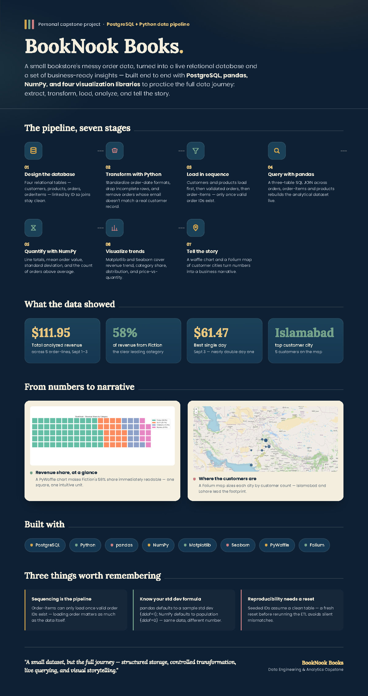

# BookNook Books — End-to-End Data Pipeline & Analytics


> An end-to-end bookstore data engineering and analytics project that transforms raw CSV data into a structured PostgreSQL database and turns the resulting data into statistical analysis, visualizations, geographic insights, and a business-oriented data story.

---

## 📌 Overview

**BookNook Books** is an end-to-end data pipeline and analytics project built around a fictional bookstore dataset.

The project demonstrates the complete journey from raw operational data to analytical insight:

```text
Raw CSV Data
     │
     ▼
Data Extraction
     │
     ▼
Cleaning & Transformation
     │
     ▼
PostgreSQL Database
     │
     ▼
SQL JOINs
     │
     ▼
Pandas DataFrame
     │
     ├── NumPy Statistical Analysis
     │
     └── Data Visualization
              │
              ├── Matplotlib
              ├── Seaborn
              ├── PyWaffle
              └── Folium
```

Rather than treating visualization as an isolated task, the project demonstrates how database design, ETL, SQL, Python analytics, and visualization can work together as one reproducible workflow.

---

## 🎯 Project Objectives

The project was designed to demonstrate the ability to:

* Build and work with a relational PostgreSQL database.
* Design and populate related database tables.
* Extract data from CSV files using Python.
* Clean and transform raw data before loading.
* Maintain relationships between customers, orders, products, and order items.
* Use SQL JOINs to reconstruct an analytical dataset.
* Use pandas for data manipulation and exploration.
* Use NumPy for numerical analysis.
* Create analytical visualizations with Matplotlib.
* Rebuild visualizations using Seaborn.
* Represent category proportions with a Waffle chart.
* Visualize geographic customer distribution with Folium.
* Communicate analytical findings through plain-English business insights.
* Build a reproducible end-to-end data workflow.

---

# 🛠️ Technology Stack

| Technology        | Purpose                                         |
| ----------------- | ----------------------------------------------- |
| **Python**        | Core programming and ETL workflow               |
| **PostgreSQL**    | Relational database and persistent data storage |
| **SQLAlchemy**    | Python–PostgreSQL database connectivity         |
| **Pandas**        | Data loading, transformation and analysis       |
| **NumPy**         | Numerical and statistical calculations          |
| **Matplotlib**    | Core data visualization                         |
| **Seaborn**       | Statistical visualization and enhanced charting |
| **PyWaffle**      | Revenue-share visualization                     |
| **Folium**        | Interactive geographic visualization            |
| **python-dotenv** | Environment variable management                 |

---

# 🗄️ Project Summary


# 🗄️ Database Architecture

The BookNook database consists of four core relational tables:

```text
customers
    │
    │ customer_id
    ▼
orders
    │
    │ order_id
    ▼
orderitems
    │
    │ product_id
    ▼
products
```

### `customers`

Stores customer information including customer identity and city.

### `products`

Stores the bookstore's product catalog, including product name, category, and pricing information.

### `orders`

Stores customer orders, including order date and status.

### `orderitems`

Stores individual products and quantities associated with each order.

The relational design allows order-level information and product-level information to be reconstructed through SQL JOINs rather than duplicating the same information across multiple tables.

---

# 🔄 ETL Pipeline

The project separates the data engineering workflow into multiple Python stages.

## 1. Database Setup

The database tables are created according to the BookNook relational schema.

This establishes the structure required for the ETL process and ensures that primary-key and foreign-key relationships can be maintained.

---

## 2. Customer & Product ETL

The customer and product source data is extracted from CSV files and prepared for database loading.

The process includes:

1. Reading source CSV files.
2. Cleaning and standardizing required fields.
3. Preparing records for database insertion.
4. Loading customer records into PostgreSQL.
5. Loading product records into PostgreSQL.
6. Verifying the resulting data.

These tables provide the master data required by the order pipeline.

---

## 3. Order ETL

Orders require additional validation because each order must be associated with a valid customer and usable order date.

The transformation process handles invalid records before loading the valid orders into PostgreSQL.

This stage demonstrates an important ETL principle:

> Data should be validated before it becomes part of the analytical database.

---

## 4. Order Item Loading

Order items are loaded after valid orders exist in the database.

This ordering is important because `orderitems` contains references to:

* `order_id`
* `product_id`

The correct table name used throughout the project is:

```text
orderitems
```

Loading order items after orders and products preserves the required relational relationships.

---

# 📊 Data Analysis

Moving on from data engineering into analytical processing.

The analytical dataset is generated directly from PostgreSQL using a three-table SQL JOIN involving:

```text
orders
    +
orderitems
    +
products
```

The resulting data contains:

* Order ID
* Order date
* Order status
* Product name
* Category
* Quantity
* Unit price

The order date is converted to a pandas datetime type and a new analytical field is created:

```python
df["line_total"] = df["quantity"] * df["unit_price"]
```

This produces the value of each individual order line.

---

# 🔢 NumPy Analysis

NumPy is used to calculate:

* Mean order-line value
* Standard deviation
* Number of order lines above the average

### Results

| Metric                   | Result |
| ------------------------ | -----: |
| Total order lines        |      5 |
| Total line value         | 111.95 |
| Average order-line value |  22.39 |
| NumPy standard deviation |  10.09 |
| Lines above average      |      3 |

The mean order-line value is therefore:

```text
22.39
```

Three of the five order lines have a value greater than this average.

### Technical Note

The project also uses `DataFrame.describe()` during exploration.

Pandas reports a standard deviation of approximately **11.28**, while NumPy's `np.std()` reports **10.09**.

This difference occurs because:

```python
np.std()
```

uses `ddof=0` by default, while pandas' descriptive statistics use the sample-standard-deviation convention with `ddof=1`.

---

# 📈 Matplotlib Visualizations

The analysis examines the data from several perspectives.

## 1. Daily Revenue Trend

Daily line values:

| Date       | Line Value |
| ---------- | ---------: |
| 2024-09-01 |      35.48 |
| 2024-09-02 |      15.00 |
| 2024-09-03 |      61.47 |

The cumulative analytical line value reaches:

```text
111.95
```

by the third recorded day.

The time-series visualization provides a simple view of how order-line value changes across the available dates.

---

## 2. Revenue by Category

| Category   | Line Value | Share |
| ---------- | ---------: | ----: |
| Fiction    |      64.95 | 58.0% |
| Sci-Fi     |      22.50 | 20.1% |
| Children's |      15.00 | 13.4% |
| Mystery    |       9.50 |  8.5% |

Fiction represents the largest share of the analyzed line value.

---

## 3. Distribution of Order-Line Values

The five calculated line values are:

```text
25.98
9.50
15.00
38.97
22.50
```

A histogram is used to visualize how these values are distributed.

The values range from:

```text
9.50 → 38.97
```

with an average of:

```text
22.39
```

---

## 4. Unit Price vs Quantity

A scatter plot compares:

* Unit price
* Quantity ordered

Each point represents an order line.

This provides a visual way to explore whether different price levels appear alongside different order quantities.

Because the analytical dataset contains only five observations, this visualization demonstrates the analytical technique rather than supporting a strong statistical conclusion.

---

# 🎨 Data Storytelling

Extending the analysis by introducing additional visualization libraries and a stronger storytelling layer.

Workflow includes:

1. Seaborn category revenue visualization
2. Seaborn category-based scatterplot
3. Waffle revenue-share visualization
4. Folium customer-city map

---

## 📊 Seaborn Category Revenue

The matplotlib category comparison is rebuilt using Seaborn.

The chart answers:

> Which bookstore category contributes the most analyzed line value?

The resulting category values remain:

* Fiction — 64.95
* Sci-Fi — 22.50
* Children's — 15.00
* Mystery — 9.50

### Business Interpretation

**Fiction generates the largest share of BookNook's analyzed line value.**

---

# 🔵 Seaborn Hue Scatterplot

A new scatterplot compares:

```text
X-axis → Unit Price
Y-axis → Quantity
Hue    → Category
```

The use of:

```python
hue="category"
```

adds category information to the visualization, allowing the same price-versus-quantity relationship to be viewed across multiple product categories.

### Business Interpretation

**The price-versus-quantity view shows how order behavior differs across BookNook's categories, while the small sample limits the strength of any relationship claim.**

---

# 🧇 Waffle Chart — Revenue Share

The Waffle chart presents the proportional contribution of each category.

### Revenue Share

```text
Fiction       58.0%
Sci-Fi        20.1%
Children's    13.4%
Mystery        8.5%
```

### Business Interpretation

**Fiction accounts for more than half of the analyzed line value, while the remaining categories make up the other 42.0%.**

The Waffle chart provides an alternative to a traditional percentage chart and makes category composition easy to interpret at a glance.

---

# 🗺️ Folium Customer Map

The customer data is grouped by city using SQL:

```sql
SELECT
    city,
    COUNT(*) AS n
FROM customers
GROUP BY city;
```

The resulting counts are visualized geographically using Folium `CircleMarker` objects.

Marker size is scaled according to the number of customers in each city.

### Customer Distribution

| City       | Customers |
| ---------- | --------: |
| Islamabad  |         5 |
| Lahore     |         4 |
| Karachi    |         3 |
| Peshawar   |         2 |
| Multan     |         2 |
| Rawalpindi |         2 |
| Faisalabad |         1 |
| Quetta     |         1 |

The interactive map is exported as:

```text
booknook_customer_map.html
```

The HTML file can be opened in a web browser to explore the customer distribution interactively.

---

# 💡 Key Project Findings

Based on the final analytical dataset:

### Order-line analysis

* 5 order lines were available for analysis.
* Total calculated line value was **111.95**.
* Average order-line value was **22.39**.
* 3 order lines were above the average.
* The highest individual order-line value was **38.97**.

### Category analysis

* Fiction generated **64.95** of line value.
* Fiction represented **58.0%** of the analyzed total.
* Sci-Fi represented **20.1%**.
* Children's represented **13.4%**.
* Mystery represented **8.5%**.

### Time analysis

The daily analytical line values were:

```text
September 1 → 35.48
September 2 → 15.00
September 3 → 61.47
```

### Geographic analysis

The customer-city analysis identified:

```text
Islamabad → 5
Lahore    → 4
Karachi   → 3
```

as the three highest customer counts in the available dataset.

---

# ⚙️ Project Structure

The repository is organized around the project's data engineering and analytics workflow:

```text
booknook-books-data-pipeline/
│
├── README.md
├── requirements.txt
├── .gitignore
│
├── src/
│   ├── database_setup.py
│   ├── customer_product_etl.py
│   ├── order_etl.py
│   ├── analysis.py
│   └── visualization.py
│
├── data/
│   └── README.md
│
├── outputs/
│   └── booknook_customer_map.html
│
├── results/
│   ├── analysis/
│   └── visualization/
│
└── docs/
    └── project_report.pdf
```

> The filenames above describe the logical organization. The repository should retain the actual filenames of the completed project scripts where appropriate.

---

# 🚀 How to Run

## 1. Clone the Repository

```bash
git clone https://github.com/maw-khan/booknook-books-data-pipeline.git
cd booknook-books-data-pipeline
```

---

## 2. Create a Virtual Environment

Windows:

```powershell
python -m venv venv
venv\Scripts\activate
```

---

## 3. Install Dependencies

```bash
pip install -r requirements.txt
```

---

## 4. Configure Environment Variables

Create a local `.env` file:

```env
DB_PASSWORD=your_postgresql_password
```

The `.env` file should **never be committed to GitHub**.

---

## 5. Create the Database Tables

Run the database setup script.

```powershell
python src/database_setup.py
```

---

## 6. Run the ETL Pipeline

Run the customer/product loading stage followed by the order and order-item stages.

```powershell
python src/customer_product_etl.py
python src/order_etl.py
```

The exact execution sequence should preserve the dependency:

```text
Customers / Products
        ↓
Orders
        ↓
Order Items
```

---

## 7. Run Analysis

```powershell
python src/analysis.py
```

This performs:

* PostgreSQL extraction
* SQL JOIN
* pandas transformation
* `line_total` calculation
* NumPy statistics
* trend analysis
* category analysis
* distribution analysis
* relationship analysis

---

## 8. Run Visualization

```powershell
python src/visualization.py
```

This produces:

* Seaborn category revenue chart
* Seaborn hue scatterplot
* Waffle chart
* Folium customer map

The interactive map is saved as:

```text
booknook_customer_map.html
```

---

# 🔐 Environment Variables

The project uses environment variables rather than hard-coding database credentials.

Example:

```env
DB_PASSWORD=your_password
```

Python retrieves the value using:

```python
from dotenv import load_dotenv
import os

load_dotenv()

password = os.environ["DB_PASSWORD"]
```

---

# 🔁 Reproducibility Notes

A clean database reset is recommended before rerunning the complete ETL workflow.

This is particularly important because the supplied order-item seed data assumes that the first valid orders receive database IDs.

If the orders table is populated repeatedly without resetting it, generated IDs may change and the order-item relationships may no longer correspond to the expected seed data.

The analytical SQL JOIN also depends on this exact table name.

---

# 🧠 What This Project Demonstrates

This project demonstrates practical experience across multiple stages of a data workflow:

### Data Engineering

* ETL
* Data cleaning
* Data transformation
* Relational database design
* PostgreSQL
* SQLAlchemy
* Data loading
* Referential integrity

### Data Analysis

* SQL JOINs
* pandas DataFrames
* GroupBy analysis
* Datetime processing
* NumPy statistics
* Descriptive statistics

### Data Visualization

* Matplotlib
* Seaborn
* PyWaffle
* Folium
* Interactive geographic visualization

### Data Communication

* Business-oriented chart interpretation
* Revenue analysis
* Category analysis
* Customer distribution analysis
* Reproducible analytical workflows

---

# 🔮 Future Improvements

Possible extensions to the project include:

* Adding automated data-quality checks.
* Introducing logging throughout the ETL pipeline.
* Separating configuration from application logic.
* Adding automated tests for transformations.
* Adding more analytical dimensions such as customer-level and product-level metrics.
* Creating a dashboard layer for interactive business reporting.
* Containerizing the pipeline with Docker.
* Automating execution through a scheduled workflow.

These extensions would move the project from a small educational pipeline toward a more production-oriented data engineering architecture.

---

# 📌 Summary

**BookNook Books** demonstrates how raw bookstore data can move through a complete data workflow:

```text
Extract
  ↓
Transform
  ↓
Load
  ↓
PostgreSQL
  ↓
SQL
  ↓
Pandas + NumPy
  ↓
Matplotlib + Seaborn
  ↓
PyWaffle + Folium
  ↓
Business Insights
```

The project combines database engineering, ETL, analytical programming, statistical analysis, visualization, and data storytelling into a single reproducible workflow.

It provides a practical demonstration of how Python and PostgreSQL can be used together to transform raw operational data into structured, analyzable, and understandable information.
